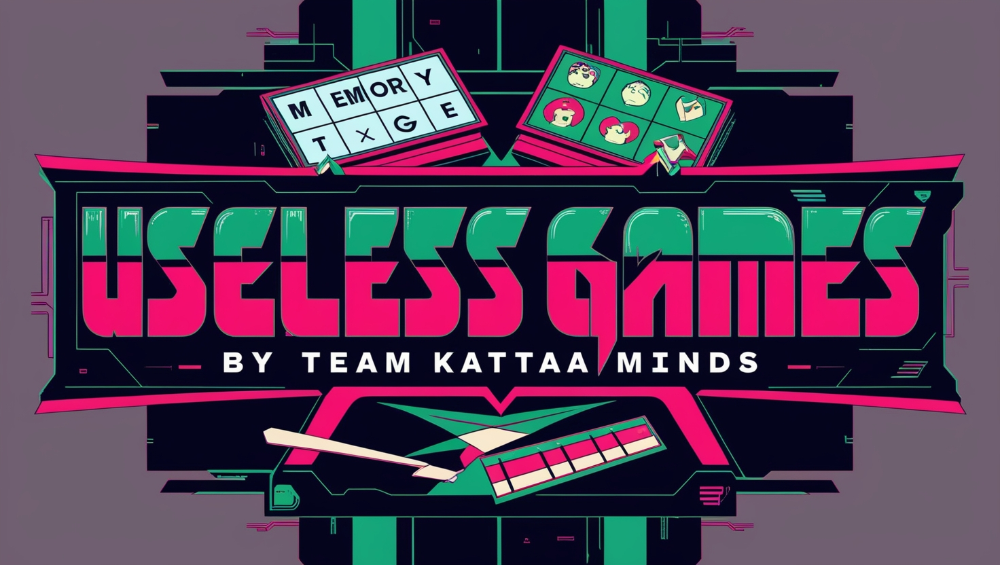

# USELESS GAMES

Welcome to the **Useless Games** project! This collection of fun, experimental games is developed by the **Kattaminds** team. The project showcases various simple yet engaging games that highlight creativity and fun without any serious purpose.

## Games Included

- 2048
- Connect Four
- Hangman
- Memory Match
- Rock-Paper-Scissors
- Snake Game
- Tic-Tac-Toe
- Platform Jumper
- Pong

## Live Demo

You can play all the games at our website: [Useless Games](https://kattaminds.github.io/useless-games/)

## Team Members

- Aghin Khalid
- Udayasooryan
- Sreejith

## Contributing

We welcome contributions to enhance this project. Feel free to fork the repository and submit pull requests.

## License

This project is open-source and available under the [MIT License](LICENSE).

Enjoy playing!
